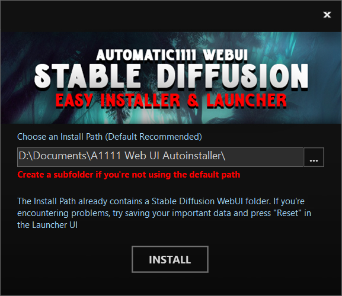
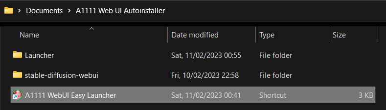
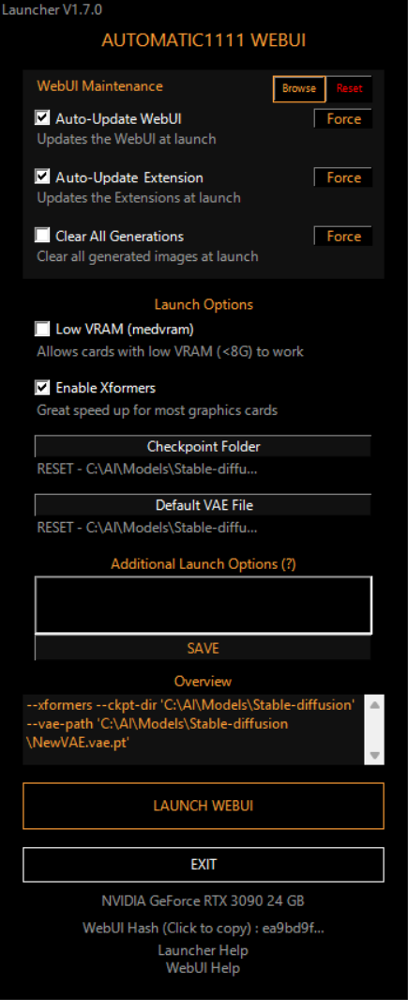

[Automatic1111 Stable Diffusion WebUI](https://github.com/AUTOMATIC1111/stable-diffusion-webui) Easy Installer and Launcher
========================

This is an **UNOFFICIAL** simplified installer & launcher for **[Automatic1111's Stable Diffusion WebUI](https://github.com/AUTOMATIC1111/stable-diffusion-webui)**

For simple installation, download the [**Latest Realease (.exe)**](https://github.com/EmpireMediaScience/A1111-Web-UI-Installer/releases/latest) and follow the [**Installation Instructions**](#installing)

If you want to improve the installer, git clone or Fork & Pull Request (this project mainly uses [**Advanced Installer 19+**](https://www.advancedinstaller.com/) and **Powershell**)

## **`⚠️ WARNING, Read Carefully ⚠️`** 

- This only works on Windows 10 and 11 x64
- This has only been tested on **NVIDIA Graphics Cards** ([**Make sure your drivers are up to date !**](https://www.nvidia.com/download/index.aspx)
)
- This installer installs the original [Automatic1111 Stable Diffusion WebUI](https://github.com/AUTOMATIC1111/stable-diffusion-webui) repository **but is not affiliated with it**, if you get questions or errors after seeing `Commit Hash: XXXXXXX` in the command window, after clicking **`LAUNCH WEBUI`**, they'll be related to the WebUI itself and not this installer, so do not ask or report them here, but [**here**](https://github.com/AUTOMATIC1111/stable-diffusion-webui/issues/new/choose)
- On the other hand, if you find a glitch before that or have a feature request, please [**fill an issue**](https://github.com/EmpireMediaScience/A1111-Web-UI-Installer/issues) and more importantly **join [the r/StableDiffusion discord](https://discord.gg/vrfEcaBTRC) to discuss the project and get general help about the WebUI**

# INSTALLING

1. Download the [**latest release**](https://github.com/EmpireMediaScience/A1111-Web-UI-Installer/releases/latest) (.exe file) and run it
2. The Installer Window:
   - **If this is your first install and you're in a hurry, just click `INSTALL`**, then **`FINISH`** and skip to **3.**
   - **Choose an Install Path** (Default is recommended). 
      > ⚠️ If you want to install it somewhere else, make sure it's in a dedicated empty folder as subsequent installs or uninstalls could actually wipe what's in it.

   - **If you see the "The Install Path Already Contains..." text** this means a Stable Diffusion WebUI folder is already present in the Installation Path 
      > if you're updating your Easy Launcher or want to use it with an existing manual WebUI install as seen bellow, this means you've selected the right folder !

   - **(Advanced) The launcher can be used with an existing manual install of Automatic1111 Stable Diffusion WebUI** by using the parent folder of the Stable Diffusion WebUI folder as the Launcher Install Path.
      > ⚠️ This parent folder should only have the Stable Diffusion WebUI folder in it, as subsequent installs or uninstalls could actually wipe what's in it !
3. After clicking **`FINISH`**, the install folder will open, it should contain the **`A1111 WebUI Easy Launcher`** shortcut, drag & drop it to the taskbar and click it to open the **[Easy Launcher](#the-launcher)**.
   > ⚠️ If you see a **`A1111 WebUI (Pin to Taskbar)`** shortcut, delete it, this is from an ancient version

# THE EASY LAUNCHER

When double clicking ***A1111 WebUI (Pin to Taskbar)*** You should be greeted with the launcher

## Features

## **`WebUI Maintenance Settings`**
- **<kbd>Browse</kbd>**: This will browse to the *stable-diffusion-webui* folder
- **<kbd>Reset</kbd>**: This will wipe the *stable-diffusion-webui* folder and reclone it from github
   > ⚠️ The folder is permanently deleted so make some back ups if needed ! A pop up will ask you for confirmation
- [x] **Auto-Update WebUI** : This will update (git pull) the WebUI everytime you launch it
- [x] **Auto-Update Extensions** : Same thing but with the extensions
- [x] **Clear Generated Images** : This will clear all previously generated images from the outputs folder at launch.
   > ⚠️ The images are permanently deleted ! A pop up will ask you for confirmation

 > The **<kbd>Force</kbd>** buttons next to the above functions will execute the relevant function as soon as you click instead of waiting for launch

   >**Note**: If you have a custom output folder, only the folder specified in the  "***Output directory for images; if empty, defaults to three directories below***" field in the WebUI settings will  be cleared.
## **`Launch Options`**
- [x] **Low VRAM** : Allows cards with low VRAM to be able to generate images, this will increase render time, but will make things smooth
- [x] **Xformers** : Greatly speeds up RTX 3000 / 4000 cards, can sometimes work with previous gens cards as well !
- **`Checkpoint Folder`** : If you don't have a specific checkpoint folder, do not click this, else select it there 💡*click the path to reset*
- **`Default VAE`** : This will allow you to select a default separate for all models VAE file 💡*click the path to reset*
- **Additional Arguments** : If you know what you're doing, you can add additional launch arguments for the UI here, as you would have done in webui-user.bat. You can also click on the text to see all the arguments available. 
  >⚠️ ***Click SAVE to confirm the additional arguments, else they won't be saved***

## **`Misc`**
- Launch Options Overview for easy verification & debug
- Launcher Version displayed
- Main GPU & VRAM displayed
- Ablity to copy the WebUI Commit Hash (practical for opening GitHub issues)
- Direct link to the Issues section of the Installer/Launcher Github
- Direct link to the Issues section of the WebUI
### **`Launcher launch options`**
> You can add launch options to the launcher itself by adding them at the end of the "A1111 WebUI (Pin to Taskbar)" shortcut target
- **`skip`** : This goes straight to the Stable Diffusion WebUI with your existing settings without displaying the Launcher UI
- **`no-autolaunch`** : This will launch the WebUI server without opening it when you click **`LAUNCH WEBUI`**, so you can just browser to `http://127.0.0.1:7860/` on your preferred browser
