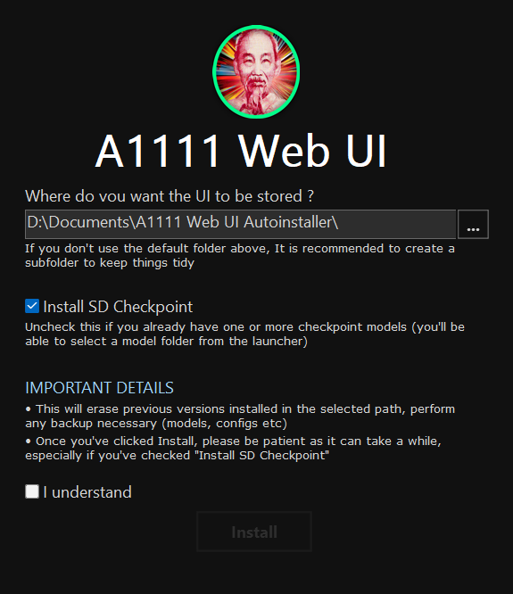
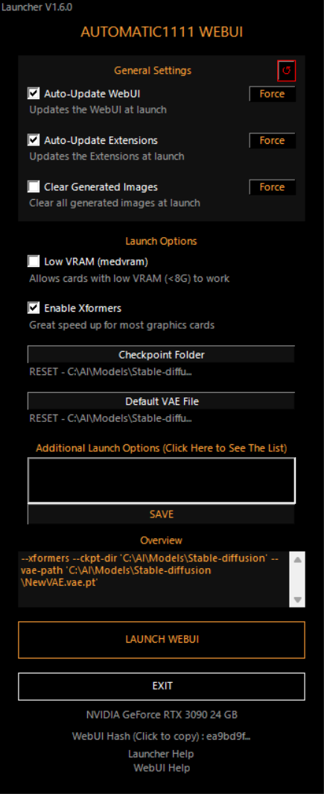

# A1111-Web-UI-Installer

This installer is a simplified installer for **[Automatic1111's Stable Diffusion WebUI](https://github.com/AUTOMATIC1111/stable-diffusion-webui)** for Windows 10 and 11 and for **NVIDIA Graphics Cards Users**

If you want to just install it, [**check the latest realease (.exe)**](https://github.com/EmpireMediaScience/A1111-Web-UI-Installer/releases), if you want to improve the installer, git clone or fork & Pull Release !

## ⚠️ Be careful, this installer will always clone the latest bleeding edge update of the webUI and that some Updates can break the WebUI, check the instructions bellow for more info

If you find a glitch or have a feature request, please [**fill an issue**](https://github.com/EmpireMediaScience/A1111-Web-UI-Installer/issues) and more importantly **join [the new Automatic1111's SD WebUI discord](https://discord.gg/5KRHgNpz) to discuss the project and get general help about the WebUI**

If you want to contribute to the code, this project mainly uses [**Advanced Installer**](https://www.advancedinstaller.com/) and **Powershell**

# INSTALLING

1. Download the [**latest release**](https://github.com/EmpireMediaScience/A1111-Web-UI-Installer/releases)
2. Make sure you're up to date with your NVIDIA Graphics Driver
3. Launch the Installer, you'll first have to install Git and Python 3.10
4. Click Next on the Welcome screen
5. On the prerequisites screen, select what you want to install
   1. If you already have Python 3.10 and Git Installed, you might be able to uncheck them
   2. If you're in doubt or have no idea what those are, keep them checked, they're essential
   3. Click next and wait for downloading/installation, be patient, the installation is made in the background
6. If everythin goes right you'll be greated with this screen :
7. 
8. Select where you want the UI to be stored - _default is fine but if you want to install things somewhere else, it is highly recommended to do it in a dedicated empty folder, else it's going to be pretty messy_
9. Select **Install SD Checkpoint** if you don't have already have a Checkpoints/Models folder (if you do, you'll be able to select it via the launcher later), **if you have no idea what this means, leave the box checked**
10. Read the Important details, then check I Understand
11. Click Install and remember, this can take a while
12. Once installed, a folder will open with a shortcut called **A1111 WebUI (Pin to Taskbar)**
13. You can drag & drop it on your taskbar if you wish, this is the launcher for the WebUI
14. Launch the shortcut to open the Custom Launcher
15. See bellow for the different features of the launcher
16. Once you've selected what you wanted, click **LAUNCH WEBUI**, it will launch a CMD window, logging what it's doing **be patient this will take a while at first**, when it's ready, it will open the webUI in your browser
17. When you're done using the WebUI, close the browser tab & close the CMD window

# THE LAUNCHER

When double clicking **A1111 WebUI (Pin to Taskbar)** You should be greeted with the launcher

## Features

- **Low VRAM** : Allows cards with low VRAM to be able to generate images, this will increase render time, but will make things smooth
- **Xformers** : Greatly speeds up RTX 3000 / 4000 cards, can sometimes work with previous gens cards as well !
- **Do Not Convert Model to FP16** : Leave it on if everything works and you don't have a GTX16XX series card
- **Checkpoint Folder** : If you don't have a specific checkpoint folder, do not click this, but if you do, select it there
- **Default VAE** : This will allow you to select a default separate for all models VAE file
- **Auto-Update WebUI** : This will update (git pull) the WebUI everytime you launch it
- **Auto-Update Extensions** : Same thing but with the extensions
- **Clear Generated Images** : This will clear all previously generated images from the outputs folder of the stable diffusion webui at launch, to give you a tidy blank slate for this session. ⚠️ **The images are permanently deleted ! A pop up will ask you for confirmation at launch if enabled, and you'll also be able to skip the deletion without disabling it.**
